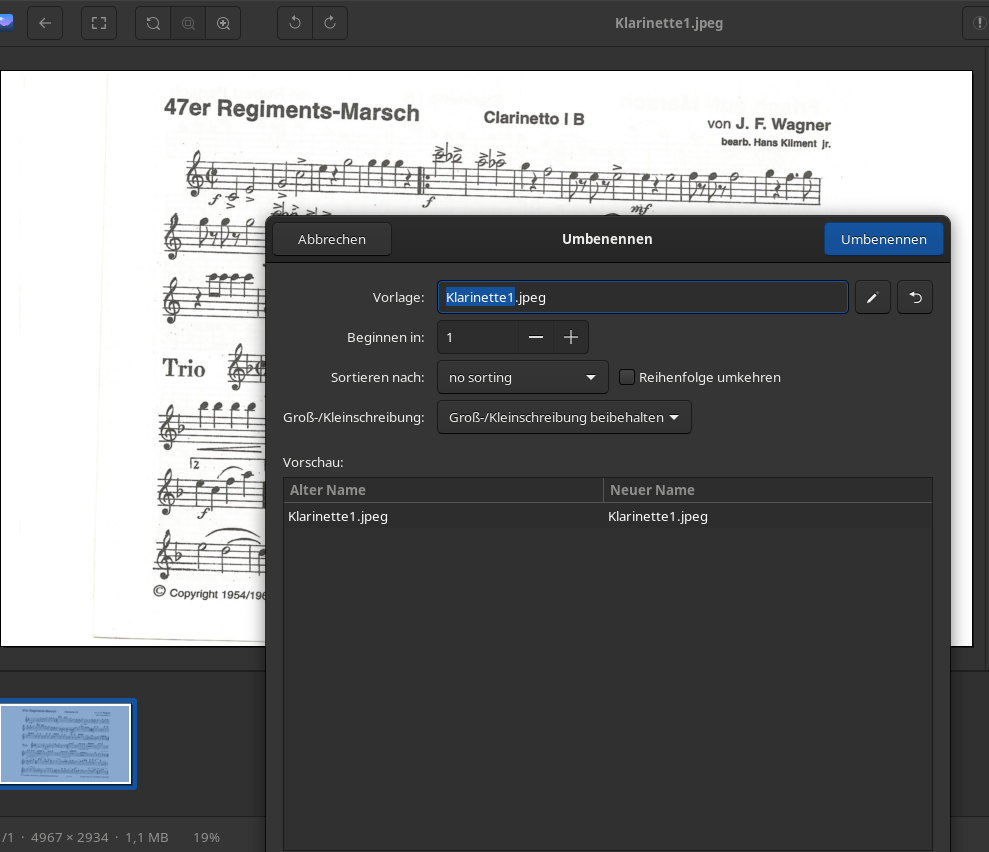

# Marschbiachl Assistent

This app assists the user for creating a Marschbiachl, by rotating and cropping
the sheet music. The program supports three commands
* main.py <input_directory> -m split -o <output_directory>
* main.py <input_directory> -m align -o <output_directory> -p <name_filter_1> <name_filter_2> ...
* main.py <input_directory> -m combine -o <output_directory> -p <name_filter_1> <name_filter_2> ...

# How to use

## split
First the user should use the split command, which splits all pdf files contained in a folder and its direct subfolder into jpegs,
and converts all images to jpegs. The results will be stored in the specified output_folder.

```
python3 main.py ./MightyMarschbiachlNoten -m split -o ./SplitMarschbiachlNoten   
```

## rename and crop
Next the user needs to find the sheets they want in the output directory, rename them in a consistent manner
(e.g. Klarinette1, Klarinette2, Klarinette3_1, Klarinette3_2) and roughly crop the images (so that there are no 
black borders left)



## align
The user can call the align command on the directory, which auto rotates and crops the images.
This command can be called with filter criteria -> strings which are contained within the filename of
all files the user wants to align

```
python3 main.py ./SplitMarschbiachlNoten -m align -o AlignedMarschbiachlNoten -p Klarinette1 Klarinette2 Klarinette3 KlarinetteE
```

For the filters to be of any use (so that only those images are aligned, which belong to a certain part)
the files need to be named consistently.

## combine
Now, the combine command can be called which combines all images to a pdf file. Again, a filter criteria can be provided.
The script should create one pdf for each filter.

```
python3 main.py ./AlignedMarschbiachlNoten -m combine -o ./MightyMarschbiachlan -p Klarinette1 Klarinette2 Klarinette3 KlarinetteE
```